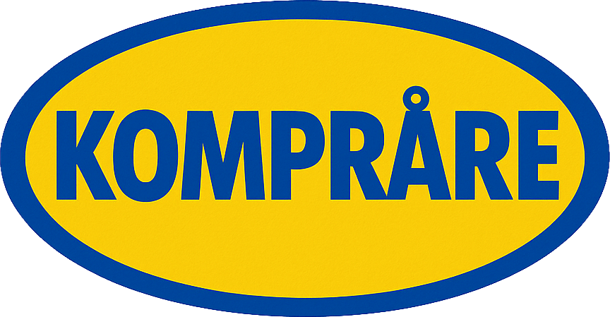

<div align="center">
  

  # KOMPRÅRE

  **Altijd de juiste GRÄBPRIS** ✨

  Compare IKEA prices across Belgium, Netherlands, France, and Germany in real-time.

  <!-- Build & Quality Badges -->
  [](https://github.com/kevinmeyvaert/ikea-compare/actions/workflows/ci.yml)
  [](https://github.com/kevinmeyvaert/ikea-compare/actions/workflows/test-all.yml)
  [](https://codecov.io/gh/kevinmeyvaert/ikea-compare)
  [](LICENSE)

  <!-- Deployment & Status -->
  [](https://komprare.vercel.app)
  [](https://github.com/kevinmeyvaert/ikea-compare/graphs/commit-activity)
  [](https://github.com/kevinmeyvaert/ikea-compare/blob/main/CONTRIBUTING.md)

  <!-- Tech Stack -->
  [](https://nextjs.org/)
  [](https://reactjs.org/)
  [](https://www.typescriptlang.org/)
  [](https://nx.dev/)
  [](https://tailwindcss.com/)
  [](https://firebase.google.com/)

  ---

  [🚀 Demo](https://komprare.vercel.app) • [🔌 Chrome Extension](#) • [🐛 Report Bug](https://github.com/kevinmeyvaert/ikea-compare/issues)

</div>

---

## 🎯 Features

- 🔍 **Single Product Comparison** - Compare prices for any IKEA product across 4 countries
- 📄 **PDF Upload** - Upload your IKEA shopping list PDF and get instant price comparisons
- 🔗 **Share Link Import** - Paste IKEA share links to compare entire shopping carts
- 🏪 **Store Selection** - Choose your preferred IKEA store for accurate availability
- 📊 **Real-time Statistics** - Track total savings and comparison metrics
- 💾 **Search History** - Access your recent product searches
- ⭐ **Favorites** - Save products for quick access
- 🌐 **Multi-platform** - Available as web app and Chrome extension
- 📱 **Responsive Design** - Works seamlessly on desktop and mobile

## 🚀 Quick start

### Prerequisites

- Node.js 20.x or later
- npm or yarn
- Firebase account (for full functionality)

### Installation

```bash
# Clone the repository
git clone https://github.com/kevinmeyvaert/ikea-compare.git
cd ikea-compare

# Install dependencies
npm install

# Set up environment variables
cp apps/komprare-web/.env.example apps/komprare-web/.env.local
# Edit .env.local with your Firebase credentials

# Start the development server
npx nx dev komprare-web
```

The web app will be available at [http://localhost:3000](http://localhost:3000)

## 🏗️ Project Structure

This is an Nx monorepo with the following structure:

```
ikea-compare/
├── apps/
│   ├── komprare-web/              # Next.js web application
│   └── komprare-chrome-extension/ # Chrome extension
└── libs/
    ├── types/                      # Shared TypeScript types
    ├── scrapers/                   # IKEA scraping logic
    └── firebase/                   # Firebase integration
```

## 🛠️ Development

### Web Application

```bash
# Start development server
npx nx dev komprare-web

# Build for production
npx nx build komprare-web

# Lint code
npx nx lint komprare-web
```

### Chrome Extension

```bash
# Build extension (development)
npx nx build komprare-chrome-extension

# Build for production
npx nx build komprare-chrome-extension --prod

# Create distributable zip
npx nx package komprare-chrome-extension
```

### Working with Libraries

```bash
# Build a specific library
npx nx build types
npx nx build scrapers
npx nx build firebase

# Type check
npx nx typecheck types

# Lint library
npx nx lint scrapers
```

### Testing

KOMPRÅRE has comprehensive test coverage across all libraries and apps using Jest.

```bash
# Run tests for a specific project
npx nx test scrapers
npx nx test firebase
npx nx test komprare-web

# Run all tests in the monorepo
npx nx run-many --target=test --all

# Run tests with coverage
npx nx test scrapers --coverage

# Run affected tests only (based on git changes)
npx nx affected --target=test

# Run tests in watch mode
npx nx test scrapers --watch

# Run tests in CI mode (no watch, with coverage)
npx nx test scrapers --ci --coverage
```

**Test Coverage:**

- **`@ikea-compare/scrapers`** - IKEA web scraping logic, product data extraction, error handling
- **`@ikea-compare/firebase`** - Authentication, store management, user data persistence
- **`komprare-web`** - API routes for PDF upload, share links, and product availability
- **`komprare-chrome-extension`** - Extension utilities and helper functions

Coverage reports are automatically uploaded to Codecov on every CI run. View the latest coverage at [codecov.io/gh/kevinmeyvaert/ikea-compare](https://codecov.io/gh/kevinmeyvaert/ikea-compare).

## 🌍 Supported Countries

| Country       | Code | Stores Supported |
|--------------|------|------------------|
| 🇧🇪 Belgium      | BE   | 9 stores         |
| 🇳🇱 Netherlands  | NL   | 15 stores        |
| 🇫🇷 France       | FR   | 37 stores        |
| 🇩🇪 Germany      | DE   | 60 stores        |

## 📦 Tech Stack

### Frontend
- **Next.js 15.2.5** - React framework with App Router
- **React 19** - UI library
- **TypeScript 5.9** - Type safety
- **Tailwind CSS 3.4.3** - Styling

### Backend & Services
- **Firebase 12.5.0** - Authentication, Firestore, Analytics
- **Axios & Cheerio** - Web scraping

### Build & Development
- **Nx 22.0.2** - Monorepo management
- **Webpack** - Chrome extension bundling
- **ESLint** - Code linting
- **PostCSS & Autoprefixer** - CSS processing

## 🎨 Key Features Explained

### PDF Upload
Upload your IKEA shopping list PDF directly to get instant price comparisons for all items. The app automatically extracts product codes and fetches current prices.

### Share Link Support
Copy a share link from the IKEA website or mobile app and paste it into KOMPRÅRE to see price differences across countries:
- `https://www.ikea.com/be/nl/favourites/receive-share/...`
- `https://applink.ikea.com/...`

### Store Selection
Choose your preferred IKEA store in each country to see accurate stock availability and pickup options.

### Chrome Extension
Browse IKEA websites and get real-time price comparisons overlaid on the page without leaving the site.

## 📊 Analytics & Privacy

- Anonymous authentication via Firebase
- Usage analytics to improve the service
- No personal data collection beyond anonymous usage patterns
- Store preferences saved locally and synced to your anonymous account

## 🤝 Contributing

Contributions are welcome! Please feel free to submit a Pull Request.

1. Fork the repository
2. Create your feature branch (`git checkout -b feature/AmazingFeature`)
3. Commit your changes (`git commit -m 'Add some AmazingFeature'`)
4. Push to the branch (`git push origin feature/AmazingFeature`)
5. Open a Pull Request

## 📝 License

This project is licensed under the MIT License.

## 👨‍💻 Author

**Kevin Meyvaert**
- Website: [kevinmeyvaert.be](https://kevinmeyvaert.be)
- GitHub: [@kevinmeyvaert](https://github.com/kevinmeyvaert)

## 🙏 Acknowledgments

- IKEA for their product data
- The Nx team for the amazing monorepo tools
- Vercel for hosting

---

<div align="center">
  Made with ❤️ in Belgium

  **KOMPRÅRE** - Because nobody should overpay for a BILLY bookcase
</div>
